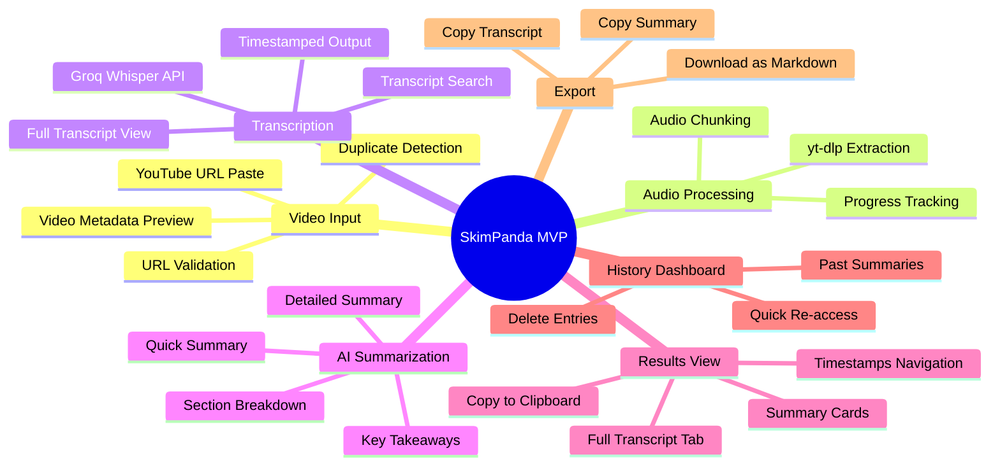
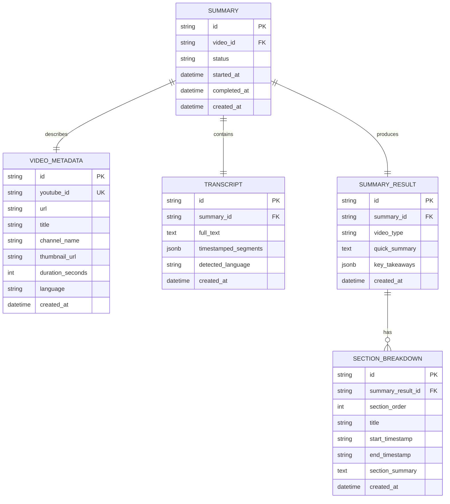
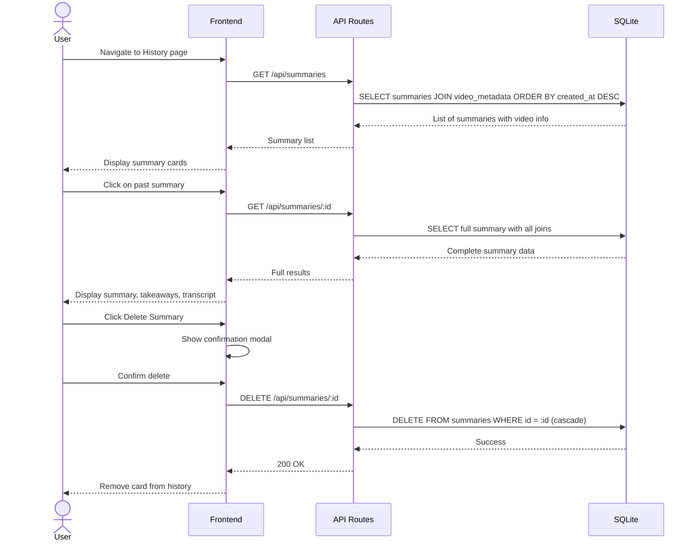
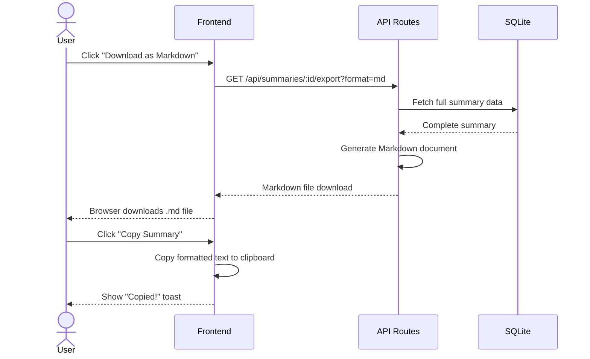
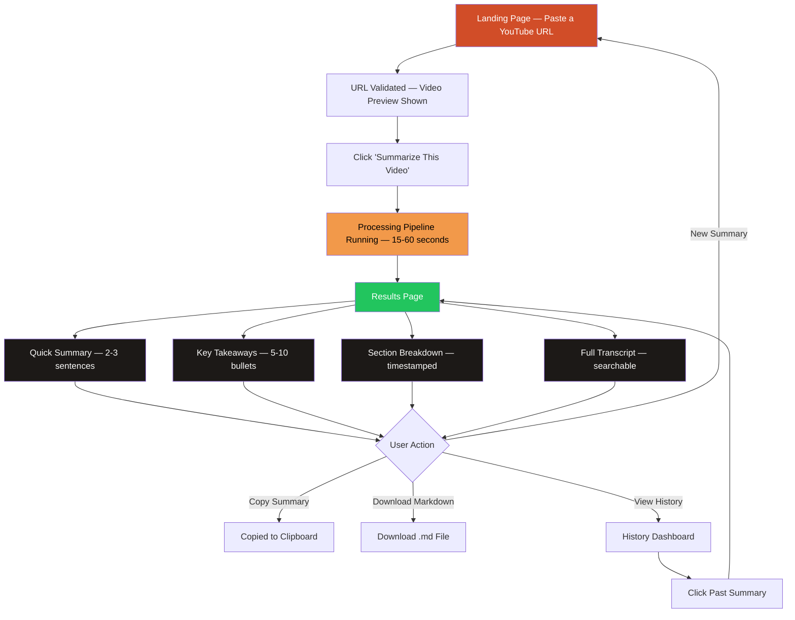

# 🐾 SkimPanda — Product Requirements Document (PRD)

**Version:** 1.0 (MVP)  
**Author:** Product Team  
**Date:** July 24, 2026  
**Status:** Draft  

---

## Table of Contents

1. [Product Overview](#1-product-overview)
2. [Tech Stack](#2-tech-stack)
3. [Features & Requirements](#3-features--requirements)
4. [Data Model](#4-data-model)
5. [System Sequence Diagrams](#5-system-sequence-diagrams)
6. [UX & Design Guidelines](#6-ux--design-guidelines)
7. [Core User Flow](#7-core-user-flow)
8. [Edge Cases & Error Handling](#8-edge-cases--error-handling)
9. [Success Metrics](#9-success-metrics)
10. [Open Questions & Future Considerations](#10-open-questions--future-considerations)

---

## 1. Product Overview

### 1.1 Vision Statement

> **SkimPanda** is an AI-powered YouTube video summarization tool that turns hour-long videos into concise, structured summaries in seconds. Paste a YouTube URL, and let SkimPanda extract, transcribe, and distill the key insights — so you absorb more knowledge in less time.

### 1.2 Problem Statement

People are drowning in long-form video content. Whether it's lectures, podcasts, tutorials, or conference talks, there's never enough time to watch everything. Users face five recurring frustrations:

| Frustration | What the user thinks |
|---|---|
| **Time Poverty** | *"This lecture is 2 hours long and my exam is tomorrow — I don't have time to watch it all."* |
| **Information Overload** | *"I need the key points from this podcast but I can't sit through 90 minutes of conversation."* |
| **Lost in the Middle** | *"I watched this tutorial last week but I can't remember the specific steps."* |
| **Skimming Inefficiency** | *"I keep scrubbing through the timeline trying to find the relevant part."* |
| **No Searchable Record** | *"There's no transcript and no way to search what was said at minute 47."* |

Existing solutions are either too limited (YouTube's auto-captions are messy and unsearchable), too expensive (professional transcription services charge per minute), or too slow (manually taking notes while watching). None of them provide **instant, structured, AI-powered summaries** from a simple URL paste.

### 1.3 Solution

SkimPanda solves this by:

1. **Ingesting** the YouTube video's audio layer via `yt-dlp` — zero cost, zero friction.
2. **Transcribing** the audio to text using Groq's blazing-fast Whisper API — near-instant transcription.
3. **Summarizing** the transcript with Google Gemini — producing structured, multi-level summaries.
4. **Presenting** the results in a clean, scannable interface with full transcript access, key takeaways, and exportable notes.

### 1.4 Target Users

| Persona | Description |
|---|---|
| **The Cramming Student** | Has an exam tomorrow, needs to absorb 5 lecture videos tonight. Wants quick summaries with key concepts highlighted. |
| **The Busy Professional** | Listens to long-form podcasts for industry insights but rarely has time to finish them. Wants key takeaways in 30 seconds. |
| **The Developer Learner** | Watches coding tutorials but needs a quick reference of the steps without re-watching the whole video. |
| **The Content Researcher** | Curates content from multiple YouTube channels, needs to quickly assess if a video is worth their time. |
| **The Accessibility Seeker** | Prefers reading over watching, or has hearing difficulties and needs better-than-auto-captions transcriptions. |

### 1.5 Scope — MVP V1

**In Scope:**
- YouTube URL input (paste-and-go)
- Audio extraction from YouTube videos
- AI-powered transcription (Groq Whisper)
- AI-powered summarization (Google Gemini) with multiple output formats
- Full transcript display with timestamps
- Summary history / dashboard
- Copy-to-clipboard and export functionality
- Responsive web application

**Out of Scope (V1):**
- User authentication (V1 is sessionless / local-storage based)
- Support for non-YouTube platforms (Vimeo, Spotify, etc.)
- Real-time / live stream transcription
- Multi-language translation
- Browser extension
- Mobile native apps
- Collaborative features (shared summaries)

---

## 2. Tech Stack

### 2.1 Architecture Overview

SkimPanda follows a **monolithic-first** architecture using Next.js for both frontend and backend, optimized for speed of development during the MVP phase. The key design constraint is **$0 infrastructure cost** by leveraging free tiers and open-source tools.

```
┌──────────────────────────────────────────────────┐
│                    CLIENT                         │
│          Next.js 15 (React + TypeScript)          │
│            Styled with Tailwind CSS v4            │
└──────────────┬───────────────────────────────────┘
               │ HTTPS
┌──────────────▼───────────────────────────────────┐
│               SERVER (Next.js API Routes)         │
│  ┌──────────┐  ┌────────────┐  ┌──────────────┐  │
│  │  yt-dlp  │  │  Groq API  │  │  Gemini API  │  │
│  │  (Audio  │  │ (Whisper   │  │ (Summarize)  │  │
│  │  Extract)│  │ Transcribe)│  │              │  │
│  └──────────┘  └────────────┘  └──────────────┘  │
└──────────────┬───────────────────────────────────┘
               │
     ┌─────────┴──────────┐
     │                    │
┌────▼─────┐       ┌──────▼──────┐
│  SQLite  │       │   Local     │
│ (Prisma) │       │   /tmp      │
│          │       │(Audio files)│
└──────────┘       └─────────────┘
```

### 2.2 Technology Choices

| Layer | Technology | Rationale |
|---|---|---|
| **Framework** | Next.js 15 (App Router) | Full-stack React framework; SSR + API routes in one codebase, optimized for Vercel deployment |
| **Language** | TypeScript | Type safety, better DX, fewer runtime errors |
| **Styling** | Tailwind CSS v4 + shadcn/ui | Rapid UI development, consistent design system, accessible components |
| **Audio Extraction** | `yt-dlp` (CLI) | Best-in-class open-source YouTube downloader; extracts audio without downloading full video; $0 cost |
| **Transcription** | Groq API (Whisper Large v3) | Fastest Whisper inference available (~10x real-time speed); free tier with generous limits |
| **Summarization** | Google Gemini 2.0 Flash | Excellent reasoning with long-context support (1M tokens); free tier available |
| **Database** | SQLite (via Prisma) | Zero-config, serverless-friendly for MVP; easy migration to PostgreSQL later |
| **ORM** | Prisma | Type-safe database queries, auto-generated types, easy migrations |
| **Deployment** | Vercel | Optimized for Next.js, automatic previews, edge network |
| **Monitoring** | Vercel Analytics | Performance monitoring included in free tier |

### 2.3 AI Pipeline Strategy

| Stage | Tool / Model | Input | Output | Cost |
|---|---|---|---|---|
| **1. Audio Extraction** | `yt-dlp` | YouTube URL | Audio file (.m4a / .webm) | $0 |
| **2. Transcription** | Groq — `whisper-large-v3-turbo` | Audio file (≤ 25MB chunks) | Timestamped transcript text | $0 (free tier) |
| **3. Summarization** | Google Gemini — `gemini-2.0-flash` | Full transcript text | Structured summary JSON | $0 (free tier) |

> **Note:** For videos longer than Groq's 25MB upload limit, the audio will be chunked into segments and transcribed sequentially, then concatenated before summarization. Gemini's 1M-token context window means even multi-hour transcripts fit comfortably.

### 2.4 Cost Analysis — $0 MVP

| Service | Free Tier Limits | Expected MVP Usage | Headroom |
|---|---|---|---|
| **Groq API** | 14,400 requests/day | ~100 transcriptions/day | 144x |
| **Google Gemini API** | 1,500 requests/day (Flash) | ~100 summaries/day | 15x |
| **Vercel** | 100GB bandwidth/mo, serverless functions | Low traffic MVP | Ample |
| **yt-dlp** | Unlimited (open-source) | N/A | ∞ |

---

## 3. Features & Requirements

### 3.1 Feature Map



### 3.2 Feature Details

#### F1: YouTube URL Input

| ID | Requirement | Priority | Acceptance Criteria |
|---|---|---|---|
| F1.1 | User can paste a YouTube URL into the input field | P0 | Standard YouTube URL formats accepted (youtube.com/watch, youtu.be, youtube.com/shorts) |
| F1.2 | System validates the URL format in real-time | P0 | Invalid URLs show inline error; valid URLs show green check |
| F1.3 | System fetches and displays video metadata preview | P0 | Thumbnail, title, channel name, and duration shown before processing |
| F1.4 | System rejects videos longer than 3 hours | P0 | Error message: "This video is over 3 hours. Please try a shorter video." |
| F1.5 | System detects and warns about previously summarized videos | P1 | "You've already summarized this video. View existing summary?" |
| F1.6 | User can press Enter or click "Summarize" to begin processing | P0 | Processing pipeline starts; input becomes read-only |

**Supported URL Formats:**

| Format | Example | Supported |
|---|---|---|
| Standard watch URL | `https://www.youtube.com/watch?v=dQw4w9WgXcQ` | ✅ |
| Short URL | `https://youtu.be/dQw4w9WgXcQ` | ✅ |
| With timestamp | `https://www.youtube.com/watch?v=dQw4w9WgXcQ&t=120` | ✅ (timestamp ignored) |
| Shorts URL | `https://www.youtube.com/shorts/abcdef12345` | ✅ |
| Playlist URL | `https://www.youtube.com/playlist?list=...` | ❌ (V2) |
| Embed URL | `https://www.youtube.com/embed/dQw4w9WgXcQ` | ✅ |

#### F2: Audio Extraction & Processing

| ID | Requirement | Priority | Acceptance Criteria |
|---|---|---|---|
| F2.1 | System extracts audio-only from YouTube video via `yt-dlp` | P0 | Audio file created in temp directory; no video downloaded |
| F2.2 | System selects optimal audio format (m4a preferred, webm fallback) | P0 | Smallest file size with acceptable quality |
| F2.3 | System chunks audio files exceeding 25MB | P0 | Chunks are ≤ 25MB each with 5-second overlap for continuity |
| F2.4 | System cleans up temporary audio files after processing | P0 | No orphaned files remain after success or failure |
| F2.5 | Processing progress is shown to the user in real-time | P0 | Step indicator: "Downloading audio → Transcribing → Summarizing" |

#### F3: AI Transcription

| ID | Requirement | Priority | Acceptance Criteria |
|---|---|---|---|
| F3.1 | System transcribes audio using Groq Whisper API | P0 | Full text transcript returned with word-level timestamps |
| F3.2 | Transcript includes timestamp markers | P0 | Timestamps at segment boundaries (every ~30 seconds) |
| F3.3 | System handles multi-language audio gracefully | P1 | Auto-detect language; transcribe in detected language |
| F3.4 | Transcription completes within 60 seconds for a 1-hour video | P0 | Groq's speed enables near-real-time; timeout at 120s with retry |
| F3.5 | System concatenates chunked transcriptions seamlessly | P0 | No duplicate text at chunk boundaries; timestamps continuous |

#### F4: AI Summarization

| ID | Requirement | Priority | Acceptance Criteria |
|---|---|---|---|
| F4.1 | System generates a **Quick Summary** (2-3 sentences) | P0 | Concise overview capturing the video's core message |
| F4.2 | System generates **Key Takeaways** (5-10 bullet points) | P0 | Actionable, scannable insights ordered by importance |
| F4.3 | System generates a **Section Breakdown** with timestamps | P0 | Video divided into logical sections with title, timestamp, and summary per section |
| F4.4 | System identifies the **video type** (lecture, tutorial, podcast, review, etc.) | P1 | Displayed as a tag/badge on the results page |
| F4.5 | Summaries are tailored to the video type | P1 | Tutorials emphasize steps; lectures emphasize concepts; podcasts emphasize guest opinions |
| F4.6 | Summarization completes within 15 seconds | P0 | Loading state shown; timeout at 30s with retry option |

**Summary Output Schema:**

```json
{
  "videoType": "tutorial",
  "quickSummary": "This video covers how to build a REST API with Node.js...",
  "keyTakeaways": [
    "Express.js is the most popular Node.js web framework",
    "Use middleware for authentication and error handling",
    "..."
  ],
  "sections": [
    {
      "title": "Introduction & Setup",
      "startTimestamp": "0:00",
      "endTimestamp": "4:32",
      "summary": "The instructor introduces the project and walks through initial setup..."
    },
    {
      "title": "Building the API Routes",
      "startTimestamp": "4:33",
      "endTimestamp": "18:45",
      "summary": "Covers creating CRUD endpoints with Express Router..."
    }
  ]
}
```

#### F5: Results Display

| ID | Requirement | Priority | Acceptance Criteria |
|---|---|---|---|
| F5.1 | Results page shows the video thumbnail, title, and metadata | P0 | Video info displayed prominently at top of results |
| F5.2 | Quick Summary displayed as a hero card | P0 | Immediately visible; no scrolling needed |
| F5.3 | Key Takeaways displayed as a bulleted list with icons | P0 | Scannable format with copy-all button |
| F5.4 | Section Breakdown displayed as expandable cards with timestamps | P0 | Click to expand section detail; click timestamp to copy |
| F5.5 | Full Transcript available in a separate tab | P0 | Scrollable, searchable transcript with timestamp markers |
| F5.6 | User can search within the transcript | P1 | Search input highlights matching terms; scrolls to first match |
| F5.7 | User can click a timestamp to copy a time-linked YouTube URL | P1 | Copies `youtube.com/watch?v=xxx&t=120` to clipboard |

#### F6: Export & Sharing

| ID | Requirement | Priority | Acceptance Criteria |
|---|---|---|---|
| F6.1 | User can copy the full summary to clipboard | P0 | "Copied!" toast notification on success |
| F6.2 | User can copy the full transcript to clipboard | P0 | "Copied!" toast notification on success |
| F6.3 | User can download summary as Markdown (.md) file | P1 | Well-formatted Markdown with headers, bullets, and timestamps |
| F6.4 | User can download summary as plain text (.txt) file | P2 | Clean text format for universal compatibility |

#### F7: History Dashboard

| ID | Requirement | Priority | Acceptance Criteria |
|---|---|---|---|
| F7.1 | User sees a list of previously summarized videos | P0 | Each entry shows: thumbnail, title, channel, date summarized |
| F7.2 | User can click into any past summary to view full results | P0 | Full results page displayed from stored data |
| F7.3 | User can delete a past summary | P1 | Confirmation modal, then permanent delete |
| F7.4 | History persists across sessions (localStorage for MVP) | P0 | Data survives page refresh and browser restart |
| F7.5 | History sorted by most recent first | P0 | Newest summaries appear at top |
| F7.6 | Empty state shows friendly panda mascot with CTA | P1 | "No summaries yet! Paste a YouTube URL to get started 🐼" |

---

## 4. Data Model

### 4.1 Entity Relationship Diagram



### 4.2 Schema Details

#### `video_metadata` Table

| Column | Type | Constraints | Description |
|---|---|---|---|
| `id` | TEXT | PK | CUID unique identifier |
| `youtube_id` | VARCHAR(20) | UNIQUE, NOT NULL | YouTube video ID (e.g., `dQw4w9WgXcQ`) |
| `url` | TEXT | NOT NULL | Original submitted URL |
| `title` | VARCHAR(500) | NOT NULL | Video title from YouTube |
| `channel_name` | VARCHAR(255) | NOT NULL | Channel / creator name |
| `thumbnail_url` | TEXT | NOT NULL | Video thumbnail URL |
| `duration_seconds` | INTEGER | NOT NULL | Video length in seconds |
| `language` | VARCHAR(10) | NULLABLE | Detected language code (e.g., `en`) |
| `created_at` | DATETIME | NOT NULL, DEFAULT NOW() | Record creation time |

#### `summaries` Table

| Column | Type | Constraints | Description |
|---|---|---|---|
| `id` | TEXT | PK | CUID unique identifier |
| `video_id` | TEXT | FK → video_metadata.id, NOT NULL | Associated video |
| `status` | VARCHAR(20) | NOT NULL, DEFAULT 'pending' | Status: pending, extracting, transcribing, summarizing, completed, failed |
| `error_message` | TEXT | NULLABLE | Error description if status is failed |
| `started_at` | DATETIME | NULLABLE | Processing start time |
| `completed_at` | DATETIME | NULLABLE | Processing completion time |
| `created_at` | DATETIME | NOT NULL, DEFAULT NOW() | Record creation time |

#### `transcripts` Table

| Column | Type | Constraints | Description |
|---|---|---|---|
| `id` | TEXT | PK | CUID unique identifier |
| `summary_id` | TEXT | FK → summaries.id, UNIQUE, NOT NULL | Parent summary (1:1) |
| `full_text` | TEXT | NOT NULL | Complete transcript text |
| `timestamped_segments` | JSON | NOT NULL | Array of segments with timestamps |
| `detected_language` | VARCHAR(10) | NULLABLE | Language detected by Whisper |
| `created_at` | DATETIME | NOT NULL, DEFAULT NOW() | Creation time |

**`timestamped_segments` JSON Structure:**

```json
[
  {
    "start": 0.0,
    "end": 5.2,
    "text": "Hey everyone, welcome back to the channel."
  },
  {
    "start": 5.2,
    "end": 12.8,
    "text": "Today we're going to build a REST API from scratch using Node.js."
  }
]
```

#### `summary_results` Table

| Column | Type | Constraints | Description |
|---|---|---|---|
| `id` | TEXT | PK | CUID unique identifier |
| `summary_id` | TEXT | FK → summaries.id, UNIQUE, NOT NULL | Parent summary (1:1) |
| `video_type` | VARCHAR(50) | NOT NULL | Detected type: lecture, tutorial, podcast, review, vlog, interview, presentation |
| `quick_summary` | TEXT | NOT NULL | 2-3 sentence overview |
| `key_takeaways` | JSON | NOT NULL | Array of 5-10 bullet-point strings |
| `created_at` | DATETIME | NOT NULL, DEFAULT NOW() | Creation time |

#### `section_breakdowns` Table

| Column | Type | Constraints | Description |
|---|---|---|---|
| `id` | TEXT | PK | CUID unique identifier |
| `summary_result_id` | TEXT | FK → summary_results.id, NOT NULL | Parent summary result |
| `section_order` | INTEGER | NOT NULL | Order of section in video |
| `title` | VARCHAR(255) | NOT NULL | Section heading |
| `start_timestamp` | VARCHAR(10) | NOT NULL | Start time (e.g., "4:33") |
| `end_timestamp` | VARCHAR(10) | NOT NULL | End time (e.g., "18:45") |
| `section_summary` | TEXT | NOT NULL | Summary of this section |
| `created_at` | DATETIME | NOT NULL, DEFAULT NOW() | Creation time |

---

## 5. System Sequence Diagrams

### 5.1 Core Summarization Flow

```mermaid
sequenceDiagram
    actor User
    participant UI as Frontend (Next.js)
    participant API as API Routes
    participant YTDLP as yt-dlp (CLI)
    participant Groq as Groq Whisper API
    participant Gemini as Google Gemini API
    participant DB as SQLite (Prisma)

    Note over User, DB: URL Input & Validation
    User->>UI: Paste YouTube URL
    UI->>UI: Validate URL format (client-side regex)
    UI->>API: GET /api/video/metadata?url=...
    API->>YTDLP: yt-dlp --dump-json [URL]
    YTDLP-->>API: Video metadata JSON
    API-->>UI: Title, thumbnail, duration, channel
    UI-->>User: Show video preview card

    Note over User, DB: Processing Pipeline
    User->>UI: Click "Summarize This Video"
    UI->>API: POST /api/summarize
    API->>DB: INSERT INTO summaries (status: pending)
    API->>DB: INSERT INTO video_metadata
    DB-->>API: Summary ID

    rect rgb(80, 40, 30)
        Note over API, Gemini: AI Processing Pipeline
        API->>DB: UPDATE summaries SET status extracting
        API->>YTDLP: yt-dlp -x --audio-format m4a [URL]
        YTDLP-->>API: Audio file path

        API->>DB: UPDATE summaries SET status transcribing
        API->>API: Chunk audio if > 25MB
        API->>Groq: POST /audio/transcriptions (audio chunks)
        Groq-->>API: Timestamped transcript segments
        API->>API: Concatenate and deduplicate chunks
        API->>DB: INSERT INTO transcripts

        API->>DB: UPDATE summaries SET status summarizing
        API->>Gemini: POST /generateContent (full transcript)
        Gemini-->>API: Structured summary JSON
        API->>DB: INSERT INTO summary_results
        API->>DB: INSERT INTO section_breakdowns (batch)
    end

    API->>API: Delete temporary audio files
    API->>DB: UPDATE summaries SET status completed
    API-->>UI: Summary complete (SSE or polling)
    UI-->>User: Display full results page
```



### 5.2 History & Re-access Flow



### 5.3 Export Flow



---

## 6. UX & Design Guidelines

### 6.1 Design Principles

| Principle | Description |
|---|---|
| **Instant Gratification** | Users want results fast. The interface should feel snappy, and the AI pipeline should stream progress updates. |
| **Scannable First** | Summaries should be digestible at a glance. Progressive disclosure — start with the quick summary, let users drill deeper. |
| **Warm & Playful** | The red panda mascot sets the tone — approachable, fun, and helpful. Never cold or corporate. |
| **Zero Friction** | No sign-up required for MVP. Paste a URL, get a summary. That's it. |
| **Mobile-Ready** | Students will use this on their phones during commutes. Every view must work on small screens. |

### 6.2 Brand Identity

| Element | Specification |
|---|---|
| **App Name** | SkimPanda |
| **Tagline** | *"Skim smarter. Watch less. Know more."* |
| **Logo Concept** | A playful red panda curled around or peeking over a play button. Simple, recognizable, and friendly. |
| **Mascot** | "Bambi" — the SkimPanda red panda mascot. Appears in loading states, empty states, error screens, and success celebrations. Expressive with different poses: reading (processing), celebrating (complete), confused (error), sleeping (empty state). |
| **Tone of Voice** | Casual, encouraging, slightly cheeky. Like a helpful study buddy, not a professor. |

### 6.3 Color Palette

The color scheme draws directly from the red panda's natural coloring — rich reds, warm oranges, and earthy tones — set against a dark background for readability and modern aesthetics.

| Token | Hex | Usage |
|---|---|---|
| **Primary (Red Panda Red)** | `#D14D28` | Primary buttons, active states, key accents (warm red-orange) |
| **Primary Light** | `#E8734A` | Hover states, secondary elements (lighter russet) |
| **Primary Dark** | `#A33820` | Pressed states, headings (deep auburn) |
| **Secondary (Panda Orange)** | `#F2994A` | Highlights, badges, progress indicators (warm amber-orange) |
| **Accent (Panda Gold)** | `#FFBA6B` | Stars, ratings, special highlights (golden honey) |
| **Background** | `#0E0D0D` | Main dark background (charcoal black) |
| **Surface** | `#1C1917` | Cards, panels (warm dark brown) |
| **Surface Elevated** | `#292524` | Modals, dropdowns, hovering cards |
| **Text Primary** | `#FAFAF9` | Main body text (warm white) |
| **Text Secondary** | `#A8A29E` | Muted text, labels, timestamps |
| **Success** | `#22C55E` | Completed status, success messages |
| **Warning** | `#F59E0B` | Long processing, caution states |
| **Error** | `#EF4444` | Errors, failures, invalid input |
| **Info** | `#3B82F6` | Informational elements, tips |

### 6.4 Typography

| Element | Font | Weight | Size |
|---|---|---|---|
| **Headings (H1–H3)** | Plus Jakarta Sans | 700 (Bold) | 32px / 24px / 20px |
| **Body** | Inter | 400 (Regular) | 16px |
| **Small / Caption** | Inter | 400 | 14px |
| **Monospace (timestamps, code)** | JetBrains Mono | 400 | 14px |
| **Score / Stats Display** | Plus Jakarta Sans | 800 (Extra Bold) | 48px |

### 6.5 Component Guidelines

**Cards:**
- Rounded corners: `16px`
- Background: `Surface` color with subtle warm border (`1px solid rgba(209, 77, 40, 0.1)`)
- Box shadow: subtle warm glow on hover (`0 4px 24px rgba(209, 77, 40, 0.08)`)
- Padding: `24px`
- Hover: gentle lift (`translateY(-2px)`) + increased glow

**Buttons:**
- Primary: Filled with `Primary` color, white text, slight gradient
- Secondary: Outlined with `Primary` border, transparent background
- Ghost: No border, `Text Secondary` color, hover shows `Surface Elevated` background
- Rounded corners: `12px`
- Height: `44px` (touch-friendly)
- Hover: brightness increase + subtle scale (`1.02`)

**URL Input:**
- Full-width with large text (`18px`)
- Left icon: link/play icon
- Right side: "Summarize" button integrated into input
- Animated border glow when focused (pulsing `Primary` color)
- Paste detection: auto-fills and shows preview if valid YouTube URL detected

**Progress Indicators:**
- Step-by-step pipeline: "🎵 Extracting Audio → 📝 Transcribing → 🧠 Summarizing → ✅ Done!"
- Each step shows active/completed state with animated transitions
- Estimated time remaining based on video duration
- Red panda mascot animation during processing (reading a book)

**Loading States:**
- Skeleton screens for content areas (warm-toned shimmer)
- Animated panda mascot for AI processing wait states
- Step-by-step progress indicator with percentage

### 6.6 Responsive Breakpoints

| Breakpoint | Width | Layout |
|---|---|---|
| **Mobile** | < 640px | Single column, stacked cards, full-width input |
| **Tablet** | 640px – 1024px | Two-column for summary + transcript side by side |
| **Desktop** | > 1024px | Full layout with wider content area, sidebar history |

### 6.7 Page Map

| Page | Route | Description |
|---|---|---|
| Home / Summarize | `/` | Hero with URL input, recent summaries below |
| Results | `/summary/[id]` | Full results: summary, takeaways, sections, transcript |
| History | `/history` | List of all past summaries with search/filter |

---

## 7. Core User Flow

### 7.1 Primary Happy Path



### 7.2 Step-by-Step Walkthrough

| Step | Screen | User Action | System Response |
|---|---|---|---|
| 1 | Home | Visits SkimPanda for the first time | Hero section with panda mascot, tagline, and prominent URL input field |
| 2 | Home | Pastes a YouTube URL | URL validated in real-time; video preview card slides in showing thumbnail, title, channel, and duration |
| 3 | Home | Clicks "Summarize This Video" | Button transitions to loading state; processing pipeline begins with step indicators |
| 4 | Processing | Waits 15–60 seconds | Animated panda mascot reading a book; progress steps update: "Extracting Audio → Transcribing → Summarizing"; estimated time shown |
| 5 | Results | Views Quick Summary | 2-3 sentence summary displayed as a hero card at the top |
| 6 | Results | Scrolls to Key Takeaways | 5-10 bullet points with copy-all button |
| 7 | Results | Clicks a Section Breakdown card | Card expands to show section summary with timestamp link |
| 8 | Results | Switches to Transcript tab | Full transcript with searchable text and clickable timestamps |
| 9 | Results | Clicks "Copy Summary" | Formatted summary copied to clipboard; "Copied!" toast appears |
| 10 | Results | Clicks "Download as Markdown" | Browser downloads a well-formatted `.md` file |
| 11 | Home | Clicks SkimPanda logo to return home | URL input shown; recent summaries displayed below |
| 12 | History | Clicks "History" in navigation | All past summaries shown as cards; click to re-view |

---

## 8. Edge Cases & Error Handling

### 8.1 Input Validation Errors

| Scenario | Detection | User Message | Recovery |
|---|---|---|---|
| Invalid URL format | Client-side regex validation | "That doesn't look like a YouTube URL. Try pasting a link like youtube.com/watch?v=..." | Keep input active, highlight field red |
| Non-YouTube URL (e.g., Vimeo) | URL parsing check | "SkimPanda currently only supports YouTube videos. Support for other platforms is coming soon!" | Keep input active |
| Private or deleted video | `yt-dlp` returns error | "This video is private, deleted, or unavailable. Double-check the URL?" | Show retry option |
| Age-restricted video | `yt-dlp` requires auth | "This video is age-restricted and we can't access it without a YouTube account. Try a different video." | Clear input |
| Video longer than 3 hours | Duration check from metadata | "This video is over 3 hours long. SkimPanda works best with videos under 3 hours." | Clear input, suggest trimming |
| Live stream (in progress) | Metadata check: `is_live` | "This is a live stream that's still ongoing. Try again after it ends!" | Keep input active |
| Region-locked video | `yt-dlp` geo-restriction error | "This video isn't available in our region. Try a different video." | Clear input |

### 8.2 Processing Pipeline Errors

| Scenario | Detection | User Message | Recovery |
|---|---|---|---|
| `yt-dlp` download failure | Non-zero exit code | "We couldn't download the audio. YouTube might be rate-limiting us. Try again in a moment." | "Retry" button; auto-retry once after 5s |
| `yt-dlp` not installed / not found | Process spawn error | "Server configuration error. We've been notified." | Log error; show contact support link |
| Audio file too large (> 500MB) | File size check after download | "This video's audio is unusually large. Try a shorter video." | Clean up file; clear input |
| Groq API timeout (> 120s) | Server-side timeout handler | "Transcription is taking longer than expected. This might be due to high demand." | "Retry" button; auto-retry once |
| Groq API rate limited (429) | HTTP status code | "We've hit our transcription limit. Please try again in a few minutes." | Show estimated wait time; auto-retry with backoff |
| Groq API error (500) | HTTP status code | "Our transcription service hit a snag. We've been notified." | Log error; "Retry" button |
| Gemini API timeout (> 30s) | Server-side timeout handler | "Summarization is taking longer than usual. Hang tight!" | Auto-retry once |
| Gemini API rate limited (429) | HTTP status code | "We've hit our summarization limit. Please try again shortly." | Show estimated wait time |
| Gemini returns malformed JSON | JSON parse error | "We had trouble formatting your summary. Retrying..." | Auto-retry with stricter prompt; fallback to raw text |
| Audio has no speech (music only) | Transcript is empty or near-empty | "This video doesn't seem to have any spoken content. It might be music-only." | Show transcript if any; skip summarization |
| Very poor audio quality | Transcript confidence is very low | "The audio quality is quite low — the transcription may have errors." | Show transcript with disclaimer; attempt summary anyway |

### 8.3 Data & Storage Errors

| Scenario | Detection | User Message | Recovery |
|---|---|---|---|
| Database write fails | Prisma error | "Something went wrong saving your summary. Please try again." | Retry operation; log error |
| Summary not found (404) | Database query returns null | "This summary doesn't exist or has been deleted." | Redirect to home page |
| Disk space for temp files exhausted | OS error on file write | "Server is temporarily out of space. We've been notified." | Log critical error; alert ops |
| localStorage full (history) | `localStorage.setItem` throws | "Your browser storage is full. Try clearing old summaries from history." | Show history with delete prompts |

### 8.4 Network & Client Errors

| Scenario | Detection | User Message | Recovery |
|---|---|---|---|
| User loses internet during processing | `navigator.onLine` + fetch error | "You seem to be offline. Processing continues on our server — check back in a moment." | Auto-reconnect and poll for results |
| User closes tab during processing | N/A (server-side processing) | N/A | Processing continues; results available via history on return |
| Slow connection during large transcript display | Performance timing | N/A | Lazy-load transcript sections; paginate if needed |

---

## 9. Success Metrics

### 9.1 North Star Metric

> **Summaries Generated Per Week** — The number of complete video summaries (transcript + summary) successfully generated per week. This directly measures core value delivery.

### 9.2 Key Performance Indicators (KPIs)

#### Acquisition Metrics

| Metric | Target (Month 1) | Target (Month 3) | Measurement |
|---|---|---|---|
| **Unique Visitors** | 2,000 | 10,000 | Vercel Analytics |
| **First Summary Generated** | 500 | 3,000 | Database events |
| **Visitor → Summary Conversion** | 25% | 35% | Analytics funnel |

#### Engagement Metrics

| Metric | Target (Month 1) | Target (Month 3) | Measurement |
|---|---|---|---|
| **Summaries per User (weekly)** | 2.0 | 3.5 | Database aggregation |
| **Copy-to-Clipboard Rate** | 40% | 55% | Client-side event tracking |
| **Export / Download Rate** | 15% | 25% | API call count |
| **Return Rate (7-day)** | 25% | 40% | Analytics (cookie-based) |
| **Average Session Duration** | 4 min | 6 min | Vercel Analytics |
| **Transcript Tab View Rate** | 30% | 40% | Client-side event tracking |

#### Quality Metrics

| Metric | Target | Measurement |
|---|---|---|
| **Pipeline Completion Rate** | > 95% | Successful / total summaries |
| **Average Processing Time (1hr video)** | < 60s | Time from "Summarize" click to results |
| **AI Error Rate** | < 3% | Failed AI calls / total calls |
| **User Satisfaction (feedback widget)** | > 4.0/5.0 | In-app thumbs up/down on summaries |

#### Performance Metrics

| Metric | Target | Measurement |
|---|---|---|
| **P95 Page Load Time** | < 2 seconds | Vercel Analytics |
| **Time to First Summary** (new visitor) | < 90 seconds | End-to-end timing |
| **Lighthouse Performance Score** | > 90 | Automated CI checks |

### 9.3 Guardrail Metrics

> **Warning:** These metrics should NOT degrade as we grow. If they breach thresholds, pause feature development and investigate.

| Guardrail | Threshold | Alert |
|---|---|---|
| **Groq API Free Tier Usage** | < 80% of daily limit | Dashboard alert |
| **Gemini API Free Tier Usage** | < 80% of daily limit | Dashboard alert |
| **Pipeline Failure Rate** | < 5% | Server-side logging |
| **Temporary Disk Usage** | < 80% of available space | Server monitoring |
| **Average Processing Time** | < 120 seconds | Performance monitoring |

---

## 10. Open Questions & Future Considerations

### 10.1 Open Questions for V1

| # | Question | Options | Decision Owner | Status |
|---|---|---|---|---|
| OQ-1 | **Should V1 require user authentication?** | (a) No auth — fully anonymous, localStorage for history (b) Optional auth — localStorage + optional account for cloud sync (c) Required auth | Product + Eng | Decided: (a) No auth for MVP |
| OQ-2 | **What's the max video duration we support?** | (a) 3 hours (b) 2 hours (c) 1 hour | Eng + Product | Decided: 3 hours |
| OQ-3 | **How to handle rate limiting when free tier is exhausted?** | (a) Queue system with wait times (b) Hard block with "try again tomorrow" (c) Fallback to a secondary AI provider | Eng | Decided: (b) |
| OQ-4 | **Should we offer multiple summary styles?** | (a) Single default style for V1 (b) Let user choose: brief / detailed / bullet-points | Product + Design | Decided: (a) |
| OQ-5 | **How to handle copyright / TOS concerns with yt-dlp?** | (a) Only extract audio temporarily, never store (b) Add disclaimer about fair use (c) Both | Legal + Product | Decided: (c) |
| OQ-6 | **Should transcripts support languages other than English?** | (a) English only in V1 (b) Auto-detect and support top 5 languages | Product + Eng | Decided: (b) since Whisper supports multi-language natively |
| OQ-7 | **Database choice: SQLite vs PostgreSQL for MVP?** | (a) SQLite — simplest, zero-config (b) PostgreSQL via Supabase — more scalable from day one | Eng | Decided: SQLite for true $0 |

### 10.2 Future Considerations (V2+)

#### V2 — Enhanced Intelligence

| Feature | Description | Estimated Effort |
|---|---|---|
| **User Accounts & Cloud Sync** | Sign up / login to save summaries across devices | Medium (4–6 weeks) |
| **Custom Summary Prompts** | Let users specify what they want extracted (e.g., "only code examples", "key dates") | Small (2–3 weeks) |
| **Multi-Language Translation** | Summarize in a different language than the video's original language | Medium (4–6 weeks) |
| **Flashcard Generation** | AI generates Anki-compatible flashcards from video content | Medium (4–6 weeks) |
| **Chat with Video** | Ask follow-up questions about the video content using RAG over the transcript | Large (8–12 weeks) |

#### V3 — Platform Expansion

| Feature | Description | Estimated Effort |
|---|---|---|
| **Multi-Platform Support** | Support Vimeo, Spotify podcasts, Apple Podcasts, Twitch VODs | Large (8–12 weeks) |
| **Browser Extension** | One-click summarize button on YouTube video pages | Medium (4–6 weeks) |
| **Playlist Summarization** | Summarize an entire YouTube playlist as a cohesive document | Medium (4–6 weeks) |
| **Audio File Upload** | Upload your own audio/video files for transcription + summary | Medium (4–6 weeks) |
| **Collaborative Summaries** | Share summaries with others via unique links | Small (2–3 weeks) |

#### V4 — Monetization & Scale

| Feature | Description | Estimated Effort |
|---|---|---|
| **Freemium Model** | Free tier (5/day) + Pro tier ($9.99/mo unlimited) | Medium (4–6 weeks) |
| **API Access** | Public API for developers to integrate SkimPanda summaries | Medium (4–6 weeks) |
| **Team / Education Plans** | Bulk pricing for universities and study groups | Large (8–12 weeks) |
| **Real-time Live Stream Summarization** | Summarize live streams as they happen | Large (8–12 weeks) |

### 10.3 Technical Debt & Architecture Considerations

| Item | Description | When to Address |
|---|---|---|
| **SQLite → PostgreSQL Migration** | Migrate from SQLite to PostgreSQL (Supabase) for multi-instance support | When deploying to production with > 1 serverless instance |
| **Background Job Queue** | Replace synchronous pipeline with BullMQ/Redis job queue for long videos | When concurrent users > 50 |
| **Audio File CDN / Object Storage** | Move temp audio files to S3/R2 if processing pipeline becomes async | When adding job queue |
| **yt-dlp Binary Management** | Bundle or manage `yt-dlp` version to prevent breaking changes from YouTube updates | Ongoing — YouTube frequently changes their API |
| **Transcript Caching** | Cache transcripts for popular/frequently-requested videos | When same videos are requested > 10 times |
| **Rate Limiter** | Implement per-IP rate limiting to prevent abuse of free AI APIs | Before public launch |

### 10.4 Risks & Mitigations

| Risk | Likelihood | Impact | Mitigation |
|---|---|---|---|
| **yt-dlp breaks due to YouTube changes** | High | Critical | Pin version; monitor yt-dlp GitHub releases; have manual update process; keep fallback to YouTube transcript API |
| **Groq / Gemini free tier deprecated or limits reduced** | Medium | High | Abstract AI providers behind interface; maintain fallback options (OpenAI Whisper local, Claude, etc.) |
| **YouTube TOS / DMCA concerns** | Medium | High | Only extract audio temporarily; never store permanently; add fair-use disclaimer; consult legal |
| **AI hallucination in summaries** | Medium | Medium | Add disclaimers; let users compare summary against transcript; feedback loop for quality |
| **Slow processing for long videos** | High | Medium | Show accurate progress estimates; allow background processing; optimize chunking |
| **Free tier API limits hit at scale** | High | High | Implement usage dashboard; queue system; plan migration path to paid tiers |
| **Server disk space from temp audio files** | Medium | Medium | Aggressive cleanup; max concurrent processing limit; temp directory monitoring |

---

**Next Steps:**

1. Resolve Open Questions (OQ-2, OQ-3, OQ-4, OQ-5, OQ-6, OQ-7) in product sync
2. Validate `yt-dlp` + Groq + Gemini pipeline with end-to-end prototype
3. Set up Next.js project with TypeScript + Tailwind CSS v4
4. Design high-fidelity mockups for Home, Results, and History pages
5. Begin Sprint 1: URL Input + yt-dlp Extraction + Groq Transcription Pipeline
6. Obtain Groq and Gemini API keys; test free tier limits

---

*This document is a living artifact and should be updated as decisions are made and requirements evolve. Last updated: July 24, 2026.*
